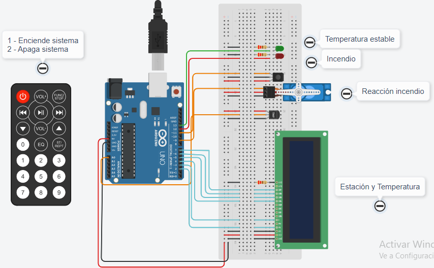

# Documentación Parcial


## Alumno
* Blanco Rivas Tomas

## Proyecto: Montacarga


## Descripción
Desarrollo de un sistema de incendio. El sistema detecta cambios de temperatura.
La temperatura y estación del año se muestra en el display. Activa el servo motor en caso de incendio. 

El control remoto se encarga de poner en marcha el sistema.
1. El botón 1.
    * Enciende el sistema de incedio.
2. El botón 2.
    * Apaga el sistema de incendio.
  
### Materiales
* 1 Arduino.

* 1 Sensor de temperatura.

* 1 Control remoto IR

* 1 Display LCD

* 1 Servo motor

* 1 Protoboard

* 2 Leds.

* Cables y resistencias necesarias para cada componente.

## Librerias
```C++
#include <Servo.h>
#include <LiquidCrystal.h>
#include <IRremote.h>
```

## Salidas Digitales
```C++
pinMode(LED_ROJO, OUTPUT);
pinMode(LED_VERDE, OUTPUT);
```

## Variables generales
```C++
unsigned long codigo;
int veranoMin = 25;
int veranoMax = 49;
int primaveraMin = 20;
int primaveraMax = 24;
int otonioMin = 15;
int otonioMax = 19;
int inviernoMin = -40;
int inviernoMax = 14;
int temperatura;
int temperaturaAnterior = 1;
int temperaturaMax = 50;
char lcdLine0[17];
char lcdLine1[17];
bool sistemaEncendido = false;
```

## Inicializar componentes

### Control remoto
irrecv es una instancia de la clase IRrecv para recibir y decodificar datos infrarrojos

Dentro del setup se habilita la recepción de datos infrarrojos.

```C++
#define CONTROL_PIN 11

IRrecv irrecv(CONTROL_PIN);

void setup()
{
  irrecv.enableIRIn(); // comienza la recepcioón de datos
}
```

### Servo
servoMotor es un objeto que permite controlar al servo motor. 

Dentro del setup, .attach(SERVO) permite controlar la posición del servo asociado al pin de la placa de arduino.

El servoMotor se inicializa en la posición 0°

```C++
#define SERVO 9

Servo servoMotor;

void setup()
{
  servoMotor.attach(SERVO);
  servoMotor.write(0);
}
```

### Lcd
miLcd es un objeto que recibe como parámetro cada pin de la placa de arduino.

Dentro del setup se incializa la comunicación entre la placa de ardunio y la pantalla lcd. Recibe como argumento 16, 2 que representan 16 caracteres por línea y 2 filas.

```C++
LiquidCrystal miLcd(2,3,4,5,6,7);

void setup()
{
  miLcd.begin(16,2);
}
```

## Funciones

### Loop
Se encarga del manejo de todo el sistema de incendio. 

Para inciar el sistema verifica si recibe una señal infrarroja.

```C++
void loop()
{
  if(irrecv.decode()) // verifica si recibe señal infrarroja
  {
    codigo = irrecv.decodedIRData.decodedRawData;

    sistemaEncendido = ActivarYApagarSistema(codigo, sistemaEncendido);
    irrecv.resume(); //reanuda la recepción de señales
  }
  if(sistemaEncendido)
  {
    // Calcular temperatura
    temperatura = ObtenerTemperatura(SENSOR_TEMP, temperatura);
    
    // Calcular estacion
    char* estacion = ObtenerEstacion(temperatura);
      
    // Display lcd
    temperaturaAnterior = MostrarTemperatura(temperatura,temperaturaAnterior, estacion);
    // Mover Servo  
    ActivarServo(temperatura, temperaturaMax);
  }
  else
  {
	RestablecerValores(LED_ROJO, LED_VERDE);
  }
}
```

### ActivarYApagarSistema
La función se encarga de encender o apagar el sistema de incendio.

codigo es la señal infrarroja decodificada recibida desde el control remoto. 0xEF10BF00 pertenece al botón 1. 0xEE11BF00 pertenece al botón 2.
sistemaEncendido es un booleano inicializado como false(apagado).

El botón 1 activa el sistema de incendio.
El botón 2 apaga el sistema de incendio.

Se muestra por el monitor serial la acción elegida.

Retorna el valor booleano de sistemaEncendido.

```C++
bool ActivarYApagarSistema(unsigned long codigo, 
                           bool sistemaEncendido)
{
  if (codigo == 0xEF10BF00)
  {
    if(!sistemaEncendido)
    {
      Serial.println("ACTIVAR SISTEMA DE INCENDIO");
      sistemaEncendido = true;
    }
  }
  else if (codigo == 0xEE11BF00)
  {
    Serial.println("APAGAR SISTEMA DE INCENDIO");
    sistemaEncendido = false;
  }
  return sistemaEncendido;
}
```
### ObtenerTemperatura
La función se encarga de leer el sensor de temperatura y calcular la temperatura del ambiente.

sensor es un #define asociado al pin de la placa de arduino donde se encuentra el sensor de temperatura. temperatura es un entero.

La función map recibe el valor de entrada lecturaSensor y transforma un rango de 20 a 358, a uno nuevo de -40 a 125. 

Retorna la temperatura obtenida.

```C++
int ObtenerTemperatura(int sensor, int temperatura)
{
  int lecturaSensor = analogRead(sensor);
  temperatura = map(lecturaSensor, 20, 358, -40, 125);
  
  return temperatura;
}
```

### ObtenerEstacion
La función se encarga de obtener la estación del año correspondiente según la temperatura.

temperatura recibe un entero que representa la temperatura ambiente.

veranoMin, veranoMax, otonioMin, otonioMax, inviernoMin, inviernoMax, primaveraMin, primaveraMax son enteros que representan el rango de temperatura para cada estación.

Retorna un string con el nombre de la estación del año correspondiente.
```C++
char* ObtenerEstacion(int temperatura)
{
  if(temperatura >= veranoMin && temperatura <= veranoMax)
  {
    return "Verano";
  }
  else if(temperatura >= otonioMin && temperatura <= otonioMax)
  {
    return "Otonio";
  }
  else if(temperatura >= inviernoMin && temperatura <= inviernoMax)
  {
    return "Invierno";
  }
  else if(temperatura >= primaveraMin && temperatura <= primaveraMax)
  {
    return "Primavera";
  }
}
```

### MostrarTemperatura
La función se encarga mostrar el valor de la temperatura y estación del año en el display LCD.

temperatura recibe el valor de la temperatura ambiente y temperaturAnterior es un entero inicializado en 1. estacion recibe una cadena de caracteres asociada a la estación del año.

LED_ROJO, LED_VERDE son #define asociados a un pin de la placa de arduino. 

temperaturaMax representa el valor entero máximo que puede alcanzar. 

lcdLine1 y lcdLine0 son arrays de 17 posiciones que representan cada caracter que puede recibir el display.

Si la temperatura cambia se limpia el display lcd.

Si la temperatura sobrepasa a la temperaturaMax se imprime incendio en el display y activa el LED_ROJO.

Retorna el valor de la temperaturaAnterior.
```C++
int MostrarTemperatura(int temperatura, int temperaturaAnterior,
                       char* estacion)
{
  if(temperatura != temperaturaAnterior)
  {
    miLcd.clear();
  }
  
  if (temperatura >= temperaturaMax)
  {
    miLcd.setCursor(0, 1);
    miLcd.print("ALERTA: INCENDIO");
    EncenderYApagarLed(LED_ROJO, LED_VERDE);
  }
  else
  {
    EncenderYApagarLed(LED_VERDE, LED_ROJO);
  	miLcd.setCursor(0, 0);
  	sprintf(lcdLine0, "Est: %s", estacion);
  	miLcd.print(lcdLine0);
  
  	miLcd.setCursor(0, 1);// ubica el cursor en columna 0 y fila 1
  	sprintf(lcdLine1, "Temp: %dC'",temperatura);
  	miLcd.print(lcdLine1);
  }
  temperaturaAnterior = temperatura;
  return temperaturaAnterior;
}
```

### ActivarServo
La función se encarga de activar una respuesta del servo motor en caso de detectar un incendio.

servoMotor es el objeto que representa al servo conectado a la placa de arduino.

temperatura recibe el valor de la temperatura ambiente y temperaturaMax el valor máximo que puede alcanzar.

Si se detecta el incendio, el servoMotor se mueve a la posición de 90°, sino se mantiene en la posición 0°.

```C++
void ActivarServo(int temperatura, int temperaturaMax)
{
  if(temperatura >= temperaturaMax)
  {
    servoMotor.write(90);
  }
  else
  {
    servoMotor.write(0);
  }
}
```

### RestablecerValores
La funcion se encarga restablecer los valores: apagar los leds, devolver el servo a la posición 0 y limpiar el display lcd.

ledUno y ledDos reciben un entero que representa el pin asociado a la placa de arduino.

miLcd es el objeto que representa al display lcd asociado a la placa de arduino.

servoMotor es el objeto que representa al servo ascociado a la placa de arduino.

```C++
void RestablecerValores(int ledUno, int ledDos)
{
  miLcd.clear();
  servoMotor.write(0);
  digitalWrite(ledUno, LOW);
  digitalWrite(ledDos, LOW);
}
```

### EncenderYApagarLed
La funcion se encarga de encender un led y apagar el otro.

ledEncendido y ledApagado reciben un entero que representa el pin asociado a la placa de arduino.

```C++
void EncenderYApagarLed(int ledEncendido, int ledApagado)
{
  digitalWrite(ledEncendido, HIGH);
  digitalWrite(ledApagado, LOW);
}
```

## Link al proyecto
* [Proyecto](https://www.tinkercad.com/things/kUltEaPkxxr)
